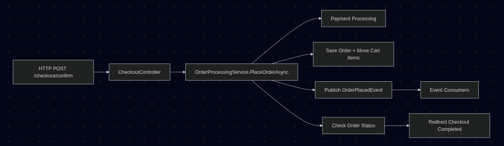
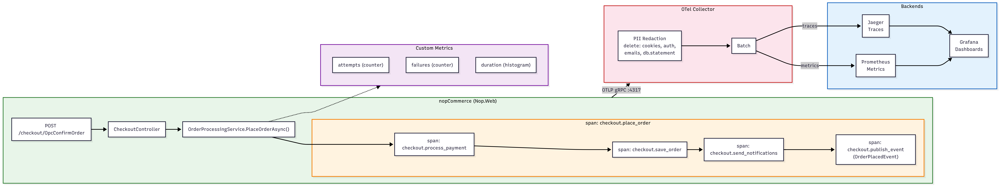
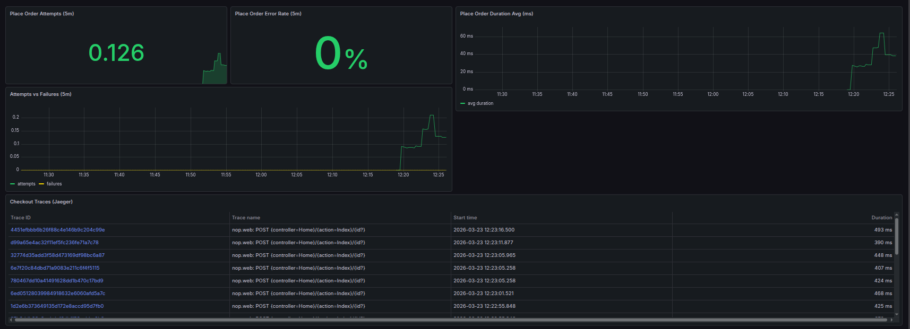
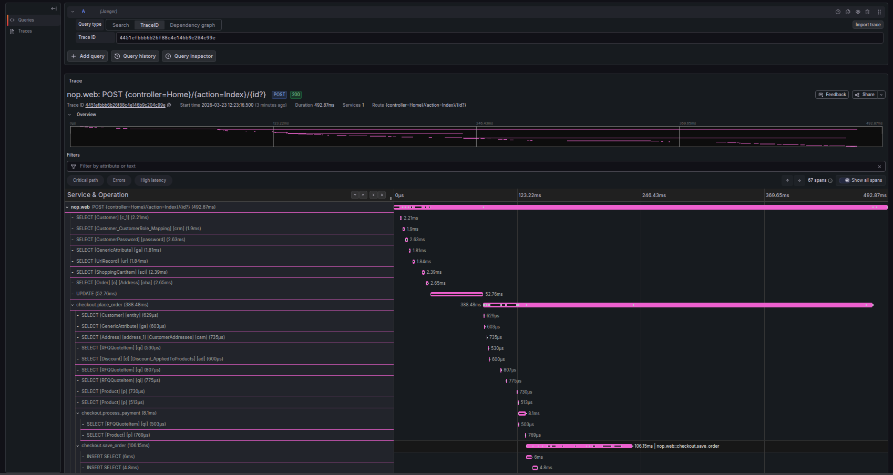
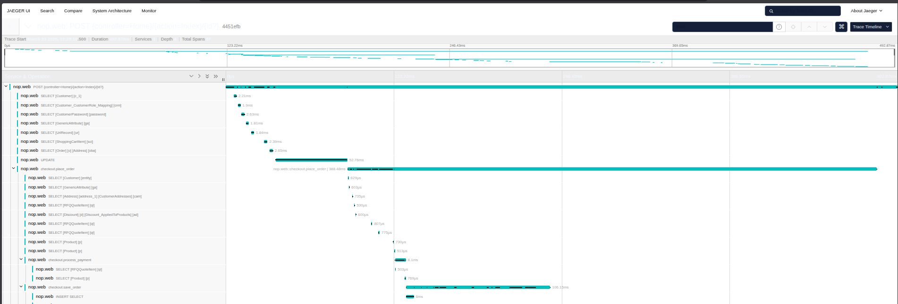
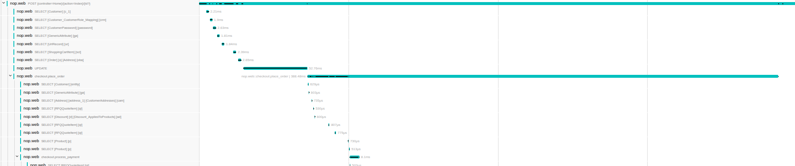
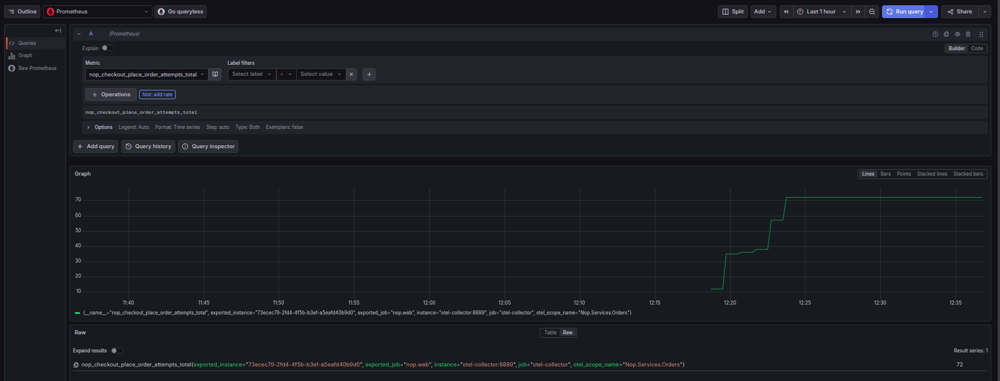

# Assignment 1 — nopCommerce + OpenTelemetry

**Software Architectures** | Master in Informatics Engineering | Individual Assignment

---

## 1. Architecture Analysis

### Layers and Dependency Rules




| Layer | Responsibility | Depends on |
|-------|---------------|------------|
| **Nop.Core** | Entities, interfaces, events, contracts | None (base) |
| **Nop.Data** | Data access, repositories, EF Core, migrations | Core |
| **Nop.Services** | Business logic, orchestration | Core, Data |
| **Nop.Web.Framework** | DI, base infrastructure, middleware | Core, Data, Services |
| **Nop.Web** | Controllers, views, HTTP entry point | All |

Dependencies flow top-down — lower layers never reference higher ones.

### IEventPublisher — Internal Event Mechanism

nopCommerce uses an in-process pub/sub pattern for inter-service communication:

```csharp
// Publishing (in OrderProcessingService)
await _eventPublisher.PublishAsync(new OrderPlacedEvent(order));

// Consuming (e.g. Brevo plugin — Nop.Plugin.Misc.Brevo/Services/EventConsumer.cs)
public class EventConsumer : IConsumer<OrderPlacedEvent>
{
    public async Task HandleEventAsync(OrderPlacedEvent eventMessage) { ... }
}
```

The `EventPublisher` resolves all `IConsumer<T>` registered via DI and calls `HandleEventAsync` sequentially. If a consumer fails, the error is logged but the remaining consumers continue. Consumers are registered automatically — `NopStartup` scans all classes implementing `IConsumer<>` and registers them as scoped.

### Where Observability Is Easy vs Hard

**Easy:**
- **Nop.Web (controllers)**: ASP.NET Core auto-instrumentation already creates spans for every HTTP request — no changes needed
- **Nop.Services**: services are injected via DI with well-defined async methods — adding `ActivitySource.StartActivity()` fits naturally
- **EventPublisher**: single point where all events pass through — natural instrumentation boundary

**Hard:**
- **Internal checkout methods**: `GetProcessPaymentResultAsync`, `SaveOrderDetailsAsync`, `MoveShoppingCartItemsToOrderItemsAsync` are `protected virtual` inside `OrderProcessingService`. Overriding via subclass would be possible but fragile and disproportionate — had to modify the class directly
- **Caching (IStaticCacheManager)**: used transparently across the stack — no easy way to know if a result came from cache or database without instrumenting the cache manager (affects entire application)
- **Plugins (Brevo, Avalara)**: independent event consumers — instrumenting them requires modifying each plugin individually

### Structural Changes Needed

I added `ActivitySource` directly in `OrderProcessingService` rather than creating a subclass to override each `protected virtual` method. The subclass approach would work in theory, but it's fragile — any change to the base class could break the overrides, and the amount of boilerplate wasn't justified for what I needed. 3 files changed, zero business logic modified.

---

## 2. Instrumented Flow

**Flow chosen**: Customer places an order (checkout) — the most business-critical flow. If checkout fails, the store loses revenue immediately. The other two flows (product search, admin publish) are important but do not have the same direct financial impact.

**Instrumented at**: `OrderProcessingService.PlaceOrderAsync` — where payment, persistence, notifications and events are orchestrated in a single method.

### Instrumented Flow Diagram



### Span Hierarchy

```
POST /checkout/OpcConfirmOrder          ← auto (ASP.NET Core)
  └─ checkout.place_order               ← custom
       ├─ checkout.process_payment      ← custom
       ├─ checkout.save_order           ← custom
       │    └─ SQL queries              ← auto (SqlClient)
       ├─ checkout.send_notifications   ← custom
       └─ checkout.publish_event        ← custom
```

### Span Attributes

- **Included** (operational only): `checkout.order.total`, `checkout.payment.method`, `checkout.cart.item_count`, `checkout.order.currency`, `checkout.shipping.method`, `checkout.result`, `order.id`, `payment.success`, `payment.status`, `checkout.discounts.count`, `checkout.gift_cards.count`
- **Excluded** (PII): emails, addresses, customer names, card numbers, cookies, authorization headers — nothing that identifies a person

### Custom Metrics

| Metric | Type | Justification |
|--------|------|--------------|
| `nop.checkout.place_order.attempts` | Counter | Monitors checkout volume. A drop or spike signals the checkout may be unreachable. |
| `nop.checkout.place_order.failures` | Counter | Counts checkout failures. Combined with attempts, calculates error rate. If it rises at 2am, the on-call engineer knows the checkout pipeline is broken. |
| `nop.checkout.place_order.duration` | Histogram | Measures checkout latency. If p95 rises, it signals degradation (slow DB, payment gateway timeout) before users start seeing errors. |

### Files Changed

| File | What changed |
|------|-------------|
| `src/Libraries/Nop.Services/Orders/OrderProcessingService.cs` | Added `ActivitySource`, `Meter`, 2 counters, 1 histogram. Wrapped `PlaceOrderAsync` with spans and metrics. Business logic untouched. |
| `src/Presentation/Nop.Web/Program.cs` | Added OpenTelemetry SDK configuration (~15 lines): tracing + metrics + OTLP exporter. |
| `src/Libraries/Nop.Services/Telemetry/NopTelemetryConstants.cs` | New file with shared constants for ActivitySource and Meter names — prevents magic string typos between files. |

---

## 3. Privacy Strategy — Defence in Depth

### In Code

I only record operational attributes: `checkout.order.total`, `checkout.payment.method`, `checkout.cart.item_count`, `checkout.order.currency`, `payment.status`, etc. No emails, addresses, names or card numbers. Each attribute was a deliberate choice — if it's not needed for debugging, it doesn't go in.

### OTel Collector — pii-redact Processor

The Collector strips authorization headers, cookies, emails, SQL statements, query strings and request bodies before anything reaches Jaeger or Prometheus. This matters because auto-instrumentation (ASP.NET, SqlClient) can capture PII that I have no control over — the Collector catches what the code misses.

**Rejected alternative**: filtering only in code — fragile, because auto-instrumentation escapes my control.

**No redaction at storage level** — Jaeger and Prometheus receive already-clean data. There is no need for storage-level filtering because the Collector handles it before export.

Configuration: [`otel-collector-config.yml`](otel-collector-config.yml)

---

## 4. Grafana Dashboard

The dashboard has 5 panels that cover the checkout flow:
- **Place Order Attempts** — how many checkouts are happening
- **Place Order Error Rate** — are any failing (failures / attempts)
- **Place Order Duration Avg** — is checkout getting slower
- **Attempts vs Failures** — if attempts rise but duration stays flat, traffic is normal; if duration rises and failures appear, something is degrading
- **Checkout Traces** — Jaeger trace links to drill into individual checkouts

### Dashboard under load



Dashboard exported as JSON: [`grafana/provisioning/dashboards/nop-checkout-observability.json`](grafana/provisioning/dashboards/nop-checkout-observability.json)

---

## 5. Evidence

### Jaeger — Trace Detail



Full trace showing span hierarchy: HTTP request → `checkout.place_order` → `checkout.process_payment` → `checkout.save_order` (with SQL queries) → `checkout.send_notifications` → `checkout.publish_event`.

### Jaeger — Trace Timeline



Same trace in timeline view — easier to spot which phase of the checkout takes the most time.

### Jaeger — Traces List



Detailed trace view showing the complete span hierarchy maintained even under concurrent load.

### Grafana Explore — Custom Metric



`nop_checkout_place_order_attempts_total` in Grafana Explore: 72 total checkouts after two k6 runs, with the staircase pattern showing load test activity. The `otel_scope_name="Nop.Services.Orders"` confirms these come from my custom instrumentation.

### Prometheus


Custom metrics visible and being scraped by Prometheus via OTel Collector.

---

## 6. Load Test

### Script

[`loadtest/checkout-flow.js`](loadtest/checkout-flow.js) — k6 script that simulates the complete checkout flow: user registration, browse, add to cart, submit cart, and checkout with 6 AJAX steps (billing address, shipping address, shipping method, payment method, payment info, confirm).

### Run

```bash
k6 run loadtest/checkout-flow.js
```

Or with custom parameters:

```bash
k6 run --vus 5 --duration 2m loadtest/checkout-flow.js
```

### Results (last run)

- **VUs**: 5 concurrent virtual users
- **Duration**: 2 minutes
- **Iterations**: 36 complete checkouts
- **Checks**: 100% success
- **HTTP requests**: zero failures
- **Checkout duration avg**: ~3636ms

### Dashboard responding to load

See [Section 4 — Grafana Dashboard](#4-grafana-dashboard) for the dashboard screenshot under load, and [Section 5 — Evidence](#5-evidence) for Jaeger traces captured during the load test.

---

## How to Run

### Prerequisites

- Docker and Docker Compose
- k6 (for load tests): `https://k6.io/docs/getting-started/installation/`

### 1. Start the application + observability stack

```bash
docker compose -f docker-compose.yml -f docker-compose.observability.yml up -d --build
```

### 2. nopCommerce installation (first time only)

Open `http://localhost:80` and complete the installation:

- **Database**: SQL Server
- **Connection string** (use "Enter raw connection string"):
  ```
  Data Source=nopcommerce_database;Initial Catalog=nopcommerce;User Id=sa;Password=nopCommerce_db_password;Trust Server Certificate=True
  ```
- Fill in admin email and password
- Click "Install"
- After installation, restart the container: `docker restart nopcommerce`

### 3. View the dashboard

- **Grafana**: `http://localhost:3000` (login: admin/admin)
  - Dashboard: Dashboards > nopCommerce > nopCommerce Checkout Observability
- **Jaeger**: `http://localhost:16686`
  - Service: `nop.web`, Operation: `checkout.place_order`

### 4. Run the load test

```bash
k6 run loadtest/checkout-flow.js
```

### 5. Stop everything

```bash
docker compose -f docker-compose.yml -f docker-compose.observability.yml down
```

---

## Repository Structure

```
.
├── README.md                                # This file
├── CRITIQUE.md                              # Architectural critique
├── docker-compose.yml                       # App (nopCommerce + SQL Server)
├── docker-compose.observability.yml         # Observability stack
├── otel-collector-config.yml                # Collector config + PII redaction
├── prometheus.yml                           # Prometheus config
├── loadtest/
│   └── checkout-flow.js                     # k6 script
├── grafana/
│   └── provisioning/
│       ├── datasources/datasources.yml      # Prometheus + Jaeger
│       └── dashboards/
│           ├── dashboards.yml
│           └── nop-checkout-observability.json  # Exported dashboard
├── docs/
│   └── images/                              # Screenshots and diagrams
└── src/
    ├── Libraries/Nop.Services/
    │   ├── Orders/OrderProcessingService.cs # Instrumentation (spans + metrics)
    │   └── Telemetry/NopTelemetryConstants.cs
    └── Presentation/Nop.Web/
        └── Program.cs                       # OTel SDK configuration
```
