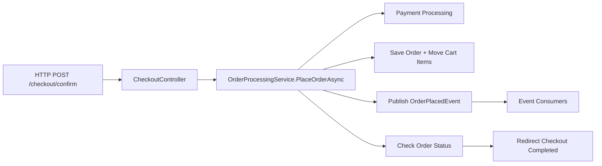

# Assignment 1 Plan (nopCommerce + OpenTelemetry)

## Objetivo
Instrumentar o fluxo `checkout/place order` no nopCommerce com OpenTelemetry, com foco em:
- tracing ponta-a-ponta
- metricas custom uteis
- estrategia de privacidade (PII)
- dashboard e evidencia sob carga

## Fluxo Escolhido
- `CheckoutController.ConfirmOrder` / `CheckoutController.OpcConfirmOrder`
- `OrderProcessingService.PlaceOrderAsync`
- `EventPublisher.PublishAsync`

## Diagrama do Fluxo (alto nivel)

## Ordem de Execucao
1. Arquitetura e limites de instrumentacao
- mapear camadas e dependencias
- justificar pontos cirurgicos de mudanca

2. Instrumentacao base OTel
- adicionar pacotes no `Nop.Web`
- configurar tracing + metrics + OTLP exporter

3. Instrumentacao do fluxo
- spans custom em pontos chave do checkout
- 2 metricas custom com valor operacional

4. Privacidade e PII
- definir campos proibidos
- aplicar redacao/masking numa camada central

5. Dashboard Grafana
- traces do fluxo
- painel por metrica custom
- painel de error rate do fluxo

6. Load test
- script k6 (ou equivalente)
- gerar carga suficiente para evidenciar sinais

7. Entregaveis finais
- README com runbook + diagrama
- CRITIQUE.md
- export JSON do dashboard
- script de carga no repositorio

## Checklist de Entrega
- [x] Flow escolhido e mapeado
- [ ] OpenTelemetry ligado na aplicacao
- [ ] Spans custom no checkout
- [ ] 2 metricas custom implementadas
- [ ] Estrategia de PII documentada e aplicada
- [ ] Dashboard pronto e exportado (JSON)
- [ ] Script de carga e instrucoes
- [ ] Evidencias (screenshots)
- [ ] CRITIQUE.md
- [ ] README atualizado com arquitetura e execucao
