# Assignment 1 Plan (nopCommerce + OpenTelemetry)

## Objetivo
Instrumentar o fluxo `checkout/place order` no nopCommerce com OpenTelemetry, com foco em:
- tracing ponta-a-ponta
- metricas custom uteis
- estrategia de privacidade (PII)
- dashboard e evidencia sob carga

## Fluxo Escolhido
- `CheckoutController.ConfirmOrder` / `CheckoutController.OpcConfirmOrder`
- `OrderProcessingService.PlaceOrderAsync`
- `EventPublisher.PublishAsync`

## Diagrama do Fluxo (alto nivel)
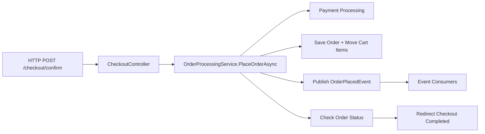

## Analise Arquitectural do nopCommerce

### Camadas e Dependencias

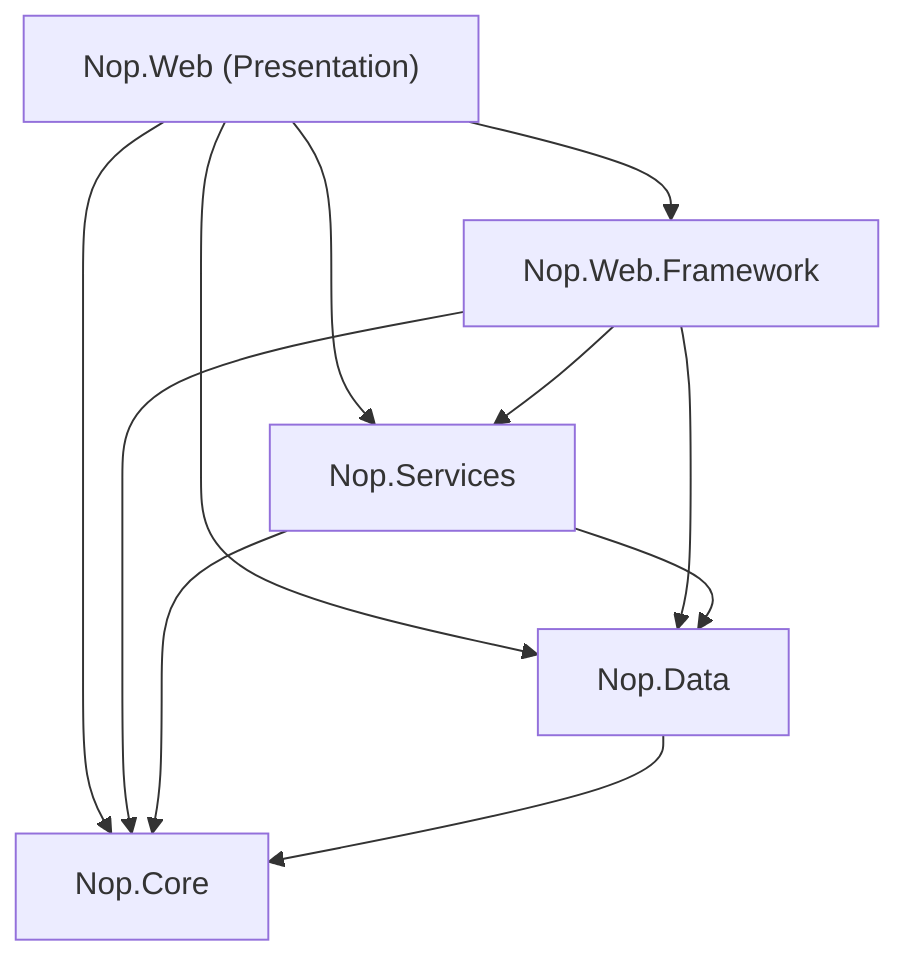

O nopCommerce segue uma arquitectura em camadas com regras de dependencia estritas:

| Camada | Responsabilidade | Depende de |
|--------|-----------------|------------|
| **Nop.Core** | Entidades, interfaces, eventos, contratos | Nenhuma (base) |
| **Nop.Data** | Acesso a dados, repositorios, migracoes | Core |
| **Nop.Services** | Logica de negocio, orquestracao | Core, Data |
| **Nop.Web.Framework** | Infraestrutura web, DI, base controllers | Core, Data, Services |
| **Nop.Web** | Controllers, views, entrada HTTP | Todas |

A dependencia e sempre de cima para baixo — nenhuma camada inferior referencia uma superior.

### IEventPublisher — Mecanismo de Eventos Interno

O nopCommerce usa um padrão pub/sub in-process para comunicacao entre servicos:

```csharp
// Publicar (em OrderProcessingService)
await _eventPublisher.PublishAsync(new OrderPlacedEvent(order));

// Consumir (qualquer classe que implemente IConsumer<T>)
public class BrevoEventConsumer : IConsumer<OrderPlacedEvent>
{
    public async Task HandleEventAsync(OrderPlacedEvent eventMessage) { ... }
}
```

O `EventPublisher` resolve todos os `IConsumer<T>` registados via DI e chama `HandleEventAsync` sequencialmente. Se um consumer falhar, o erro e logado mas os restantes continuam a executar. Suporta `IStopProcessingEvent` para interromper a cadeia.

Os consumers sao registados automaticamente no DI — o `NopStartup` faz scan de todas as classes que implementam `IConsumer<>` e regista-as como scoped.

### Onde e Facil/Dificil Adicionar Observabilidade

**Facil:**
- **Nop.Web (controllers)**: a auto-instrumentacao do ASP.NET Core ja cria spans para cada request HTTP automaticamente — nao precisamos de tocar nos controllers
- **Nop.Services (servicos)**: os servicos sao injectados via DI e tem metodos async bem definidos — basta adicionar `ActivitySource.StartActivity()` no inicio de cada metodo
- **EventPublisher**: ponto natural de instrumentacao — um unico lugar onde todos os eventos passam

**Dificil:**
- **Metodos privados dentro dos servicos**: metodos como `GetProcessPaymentResultAsync`, `SaveOrderDetailsAsync`, `MoveShoppingCartItemsToOrderItemsAsync` sao privados dentro do `OrderProcessingService` — para instrumenta-los precisamos de modificar o codigo da classe directamente
- **Caching (IStaticCacheManager)**: o cache e usado extensivamente mas de forma transparente — nao ha forma facil de saber se um resultado veio do cache ou da BD sem instrumentar o cache manager
- **Plugins**: os plugins (Brevo, Avalara, etc.) sao event consumers independentes — instrumenta-los requer modificar cada plugin individualmente

### Mudancas Cirurgicas Necessarias

As mudancas ao codigo existente foram minimizadas:

1. **`OrderProcessingService.cs`** — adicionamos `ActivitySource` e `Meter` como campos estaticos, e wrapping do `PlaceOrderAsync` com spans e metricas. A logica de negocio nao foi alterada.

2. **`Program.cs` (Nop.Web)** — adicionamos a configuracao de OpenTelemetry (tracing + metrics + OTLP exporter). Mudanca isolada no ponto de entrada da aplicacao.

3. **`otel-collector-config.yml`** — novo ficheiro de infraestrutura, sem impacto no codigo.

A decisao de instrumentar no `OrderProcessingService` (camada Services) em vez do controller (camada Presentation) foi intencional: e onde a logica de negocio vive e onde os sub-passos (pagamento, inventario, notificacoes) sao orquestrados.

## Ordem de Execucao
1. Arquitetura e limites de instrumentacao
- mapear camadas e dependencias
- justificar pontos cirurgicos de mudanca

2. Instrumentacao base OTel
- adicionar pacotes no `Nop.Web`
- configurar tracing + metrics + OTLP exporter

3. Instrumentacao do fluxo
- spans custom em pontos chave do checkout
- 2 metricas custom com valor operacional

4. Privacidade e PII
- definir campos proibidos
- aplicar redacao/masking numa camada central

5. Dashboard Grafana
- traces do fluxo
- painel por metrica custom
- painel de error rate do fluxo

6. Load test
- script k6 (ou equivalente)
- gerar carga suficiente para evidenciar sinais

7. Entregaveis finais
- README com runbook + diagrama
- CRITIQUE.md
- export JSON do dashboard
- script de carga no repositorio

## Checklist de Entrega
- [x] Flow escolhido e mapeado
- [x] OpenTelemetry ligado na aplicacao
- [x] Spans custom no checkout
- [x] 2 metricas custom implementadas
- [x] Estrategia de PII documentada e aplicada
- [x] Dashboard pronto e exportado (JSON)
- [x] Script de carga e instrucoes
- [x] Evidencias (screenshots)
- [x] CRITIQUE.md
- [x] README atualizado com arquitetura e execucao

## Evidencias

### Grafana
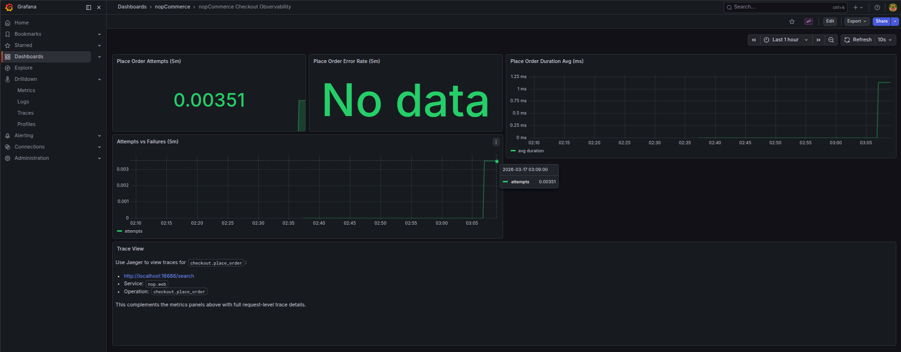
Dashboard com paineis de attempts, error rate, duracao media e comparacao attempts vs failures.

### Jaeger
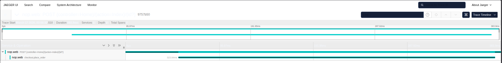
Lista de traces do servico `nop.web` — cada trace corresponde a um request HTTP processado pela aplicacao.

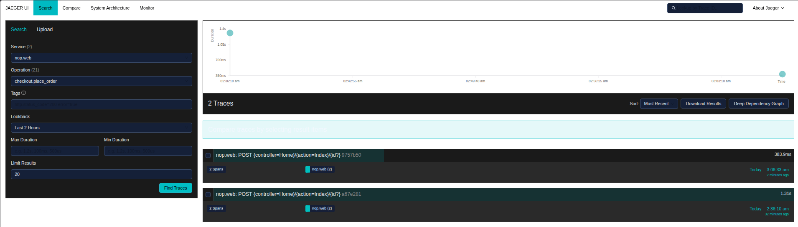
Detalhe de um trace mostrando o span `checkout.place_order` como filho do request HTTP.

### Jaeger — PII redaction
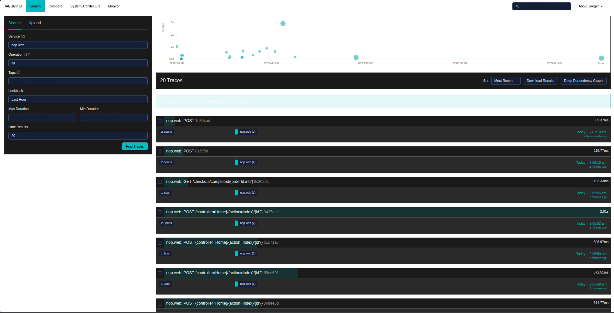
Apos configurar o processor `attributes/pii-redact` no OTel Collector, os traces mostram apenas dados operacionais — sem cookies, authorization headers, emails ou SQL statements.

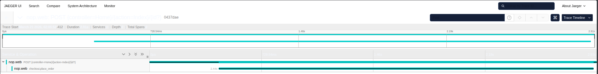
Trace do checkout completo: span HTTP pai com span `checkout.place_order` filho. Atributos visiveis sao apenas `checkout.result`, `checkout.flow`, `checkout.error_count` — zero PII.

### Jaeger — Sub-spans do checkout
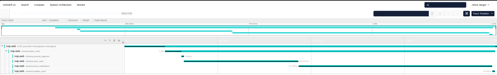
Trace detalhado do checkout com hierarquia completa de 6 spans: request HTTP -> `checkout.place_order` -> `checkout.process_payment` -> `checkout.save_order` -> `checkout.send_notifications` -> `checkout.publish_event`. Cada sub-span isola uma fase do fluxo, facilitando a identificacao de bottlenecks.

### Prometheus
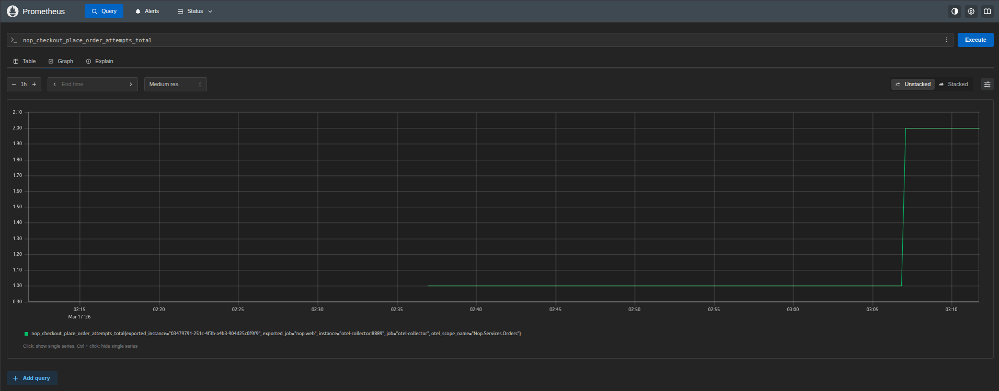
Metricas custom (`nop_checkout_place_order_attempts_total`, `failures`, `duration`) visiveis e a serem scrapeadas pelo Prometheus via OTel Collector.

### Load Test (k6)

#### Resultados
- **VUs**: 5 utilizadores virtuais concorrentes
- **Duracao**: 2 minutos
- **Iteracoes**: 55 checkouts completos
- **Checks**: 605/605 (100% sucesso)
- **HTTP requests**: 990 (zero falhas)
- **Checkout duration avg**: 4217ms (p95: 4675ms)
- **HTTP req duration p95**: 421ms (threshold < 5000ms)

#### Grafana sob carga
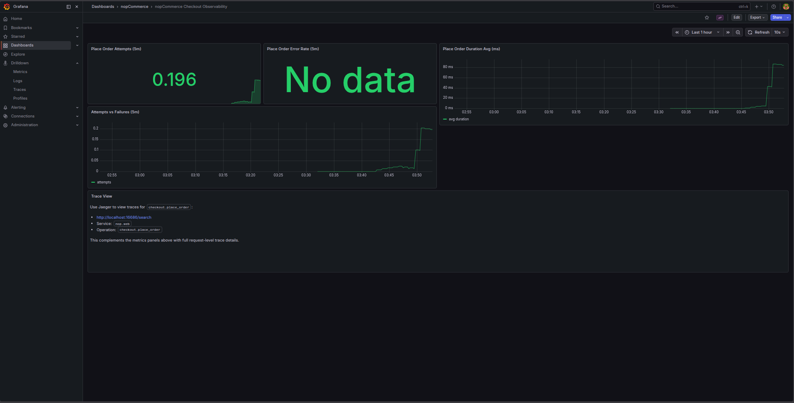
Dashboard durante o load test: Place Order Attempts a subir, Duration Avg com pico visivel, painel Attempts vs Failures mostra carga sustentada.

#### Jaeger sob carga
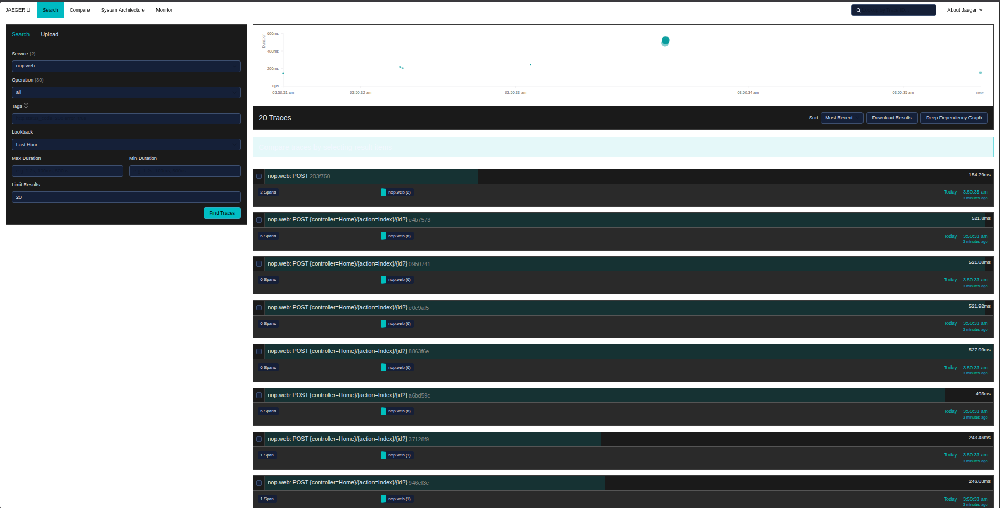
Lista de traces durante o load test — multiplos traces com 6 spans cada, correspondentes aos checkouts concorrentes.

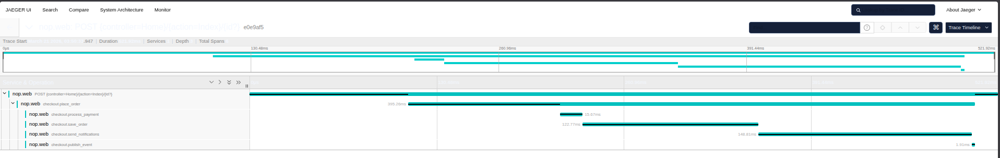
Detalhe de um trace sob carga mostrando a hierarquia completa de sub-spans mantida mesmo com concorrencia.
